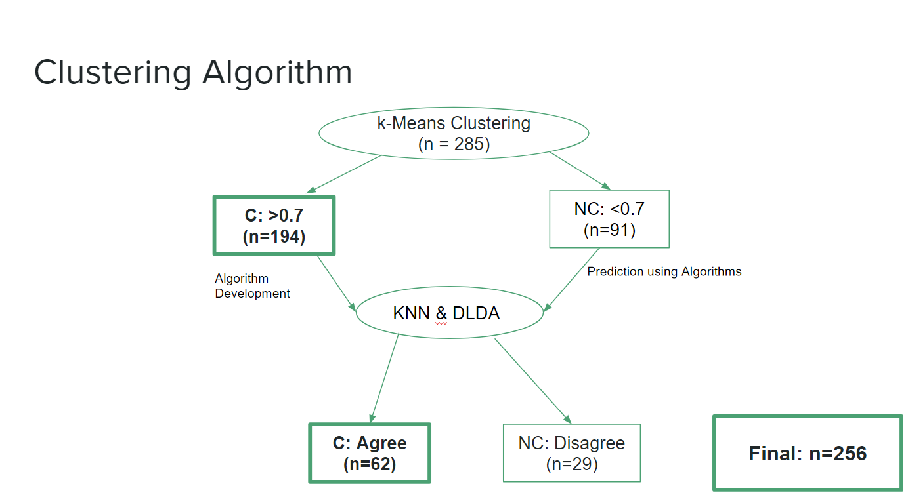
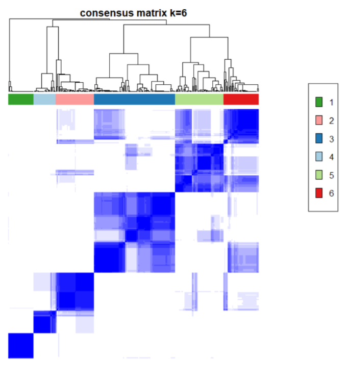

#Curated Ovarian Data and Gene Filtering
  
```{r, eval=F}
#library(BiocInstaller)
#biocLite("curatedOvarianData")
#biocLite("ConsensusClusterPlus")
library(ConsensusClusterPlus)
library(curatedOvarianData)
library(Biobase)
library(matrixStats)
library(dplyr)

data(GSE9891_eset) #pulls data we are using

#gene filtering: the data was already log transformed
#Genes with log expression values of <7 and a variance of
  #<0.5 were filtered out before clustering, leaving 8,732 probe sets
rM=rowMeans((exprs(GSE9891_eset)))
rVar=rowVars(exprs(GSE9891_eset))

#Clinical Variables
#Grade, Stage (Summary vs. tumor), substage, age, tax, recurrence status, site of first recurrence,primary therapy outcome success
#Debulking, % normal stromal tumor cells , batch

table(rM<7,rVar<0.5)

#k Means Clustering Begins Here
d=exprs(GSE9891_eset)
d2 = d[which(rM>=7 | rVar >= 0.5),] #filtering out the genes
```


#Clustering Algorithm
Our paper of interest provided an explanation of their clustering pipeline, however their methods section did not include explicit instructions or code as to how execute their algorithm.  Piecing together their methods, we were able to create a pipeline of our own as can be seen in the figure below.  Additionally, the R package used in the first step of our pipeline was not released until 2010 while this paper was released in 2008.  We feel that while it is clear that the authors did not use this specific package, the methods implemented by this package align well with their outlined methods.  It has also become apparent that the data that we have obtained does not exactly align with the data used in their analysis.  Due to this, we have had to made several decisions that slightly detour from the authors original intent.  Finally, since the authors did not release their cluster membership, it is impossible for us to validate their analysis.  We therefore aim to follow their procedure and identify areas in which the methods could be improved or altered. 




##Consensus Cluster Plus

The first step in our clustering pipeline is to implement a K-Means clustering algorithm to classify our samples into one of K clusters.  The choice of the number of clusters was chosen to be six by the authors of the paper using the GAP statistic.  For the purposes of this project, we will not validate this number and will instead assume this to be the appropriate number of clusters for our data.  Since K-Means clustering is dependent on the initial starting values of the centroids, we will be executing this algorithm 1000 times.  The R package `ConsensusClusterPlus` can execute this efficiently as well as provide a value for each sample indicating the proportion of times that sample was clustered into that specific cluster.  This package also allows for the user to specify a proportion of genes and samples to be sampled for each iteration as well as the method for calculating distances.  We chose proportions of 1 for both the genes and samples as well as a Pearson distance metric.  The figure below indicates how often subjects were clustered together.  Samples are on both the rows and columns of the matrix with the first sample being in the first column and last row.  The darker blue the square is, the more often that sample is clustered with the sample on the corresponding row.  The ideal result for this figure is to have several dark blue squares on the diagonal with little color outside of the local squares.  Clusters 1, 2, and 4 have very nice strong squares indicating that those samples are in strong agreement with each other.  On the other hand, clusters 3, 5, and 6 have lots of noise which indicate that there is less of a consensus as to which cluster these samples belong to.  After execution of the ConsensusClusterPlus algorithm, samples were classified to be either consensus or non-consensus based on whether or not they had a proportion of agreement with a cluster at greater than 80%.  This threshold was specified by the authors of the paper, however when trying to recreate their analysis we found that using 80% eliminated all samples from cluster three.  We therefore decided to relax this threshold to 70% which allowed us to obtain samples in cluster three.  This gave 194 consensus samples which will be used in the next step of our clustering pipeline to try and salvage the remaining non-consensus samples.  The R code for `ConsensusClusterPlus` can be seen below. 



  

```{r,eval=F}
#Run Consensus Cluster Plus to obtain consensus set
results = ConsensusClusterPlus(d2,maxK=6,reps=1000,pItem=1,pFeature=1,clusterAlg="kmdist",distance="pearson",seed=12)
table(results[[6]][["consensusClass"]])
icl = calcICL(results)
icl6=(icl$itemConsensus)[(icl$itemConsensus)$k==6,]

icl6%>%group_by(item)%>%filter( itemConsensus==max(itemConsensus))->outICL6
sum(outICL6$itemConsensus<0.7)

#Subset to consensus set
#PROPOSAL: Subset to 70% instead
consenSet=outICL6$item[outICL6$itemConsensus>0.7]
#Obtain clusters for consensus set
yClust=outICL6$cluster[outICL6$itemConsensus>0.7]

```
  
  
  
##K Nearest Neighbor and Diagonal Linear Discriminant Analysis

While `ConsensusClusterPlus` is an unsupervised method in that the true cluster membership is not known, we will now assume that the predicted cluster membership is the known truth for the consensus samples.  Using these samples, we then create a prediction algorithm using K nearest neighbor and Diagonal Linear Discriminant Analysis.  A leave-one-out cross validation was conducted on the consensus sample set to determine misclassification rates for several different possible values of K.  The K which provided the lowest misclassification rate was selected for our final algorithm.  With an appropriate K chosen, the model was fit using the consensus set and predicted values were calculated for the non-consensus set.  The R code for this calculation is seen below.  

```{r,eval=F}
trainSet=d2[,consenSet]

#Find NonConsensus Set
nonConSet=outICL6$item[outICL6$itemConsensus<=0.7]
testSet=d2[,nonConSet]

#Run K Nearest Neighbor Algorithm
library(class)

#Calculates error rate for specified k value on our training set. 
#low and high are the lower and upper bounds of k to be used
#finding the appropriate k to be used 
findBestK=function(low,high,by=1){
  error=NULL
  
for(k in seq(low,high,1)){
    crossVal=knn.cv(t(trainSet),yClust,k=k)
    error[k]<-mean(crossVal!=yClust) #proportion of misclassification, since crossVal! != yClust is 0 or 1
  }
  return(error)
}

kLow=1
kHigh=30
kError=findBestK(kLow,kHigh)
chosenK=((kLow:kHigh)[(kError==min(kError))])[1] #choose k to minimize the error


##Find KNN Classification of test data set
  #prediction of a value in our noncensenus set
knnOut=knn(train=t(trainSet),test=t(testSet), cl=yClust,k=chosenK)
```


Diagonal linear discriminant analysis is identical to LDA with the exception that the covariance matrix is assumed to be diagonal.  This allows for better computation time in high dimensional settings.  As we did in KNN, we train our DLDA algorithm on the consensus set and then find subgroup membership for our non-consensus set.  The predictions for KNN and DLDA are then compared and samples that have the same prediction value are including in the final set while the samples that disagreed are removed and considered to be non-consensus.  The code which executes the DLDA as well as the comparison of our two supervised methods can be seen below.  The cluster memberships as well as the point in our pipeline at which cluster membership was assigned are recorded and a final set is created for analysis in the rest of this paper.  All R code for our clustering pipeline was not run in this RMarkdown file due to the extensive computation time and thus the final set was saved to be used in future analyses.  

```{r,eval=F}

####LDA####
library(HiDimDA)
outLda=Dlda(t(trainSet),as.factor(yClust),ldafun="classification")
p1=predict(outLda,t(testSet))

#Adding Classification & Cluster Variables to ExpressionSet
# Classification = 1 if CC+, 2 = KNN & DLDA Agree, 3 = Not Classified
#ClusterMem = 1-6, 0 if Not Classified
classVec=(knnOut==(as.numeric(p1$class)))
names(classVec)=colnames(testSet)

classVec2=rep(1,length(consenSet))
names(classVec2)=consenSet
classVec3=ifelse(classVec==T,2,3)

clusterMem=ifelse(classVec==TRUE, knnOut, 0)
clusterMem2=c(clusterMem,yClust)
clusterMem3=clusterMem2[colnames(GSE9891_eset)]

classification=c(classVec3,classVec2)
classification2=classification[colnames(GSE9891_eset)]

##Classification Variable is 1 if >0.7 in Classification Cluster +, 2 if classified via KNN and Dlda, and 3 if NC
finalSE=GSE9891_eset[which(rM>=7 | rVar >= 0.5),]
finalSE$classification=classification2
finalSE$clusterMem=clusterMem3

save(finalSE,file="finalSet")
``` 
  
 